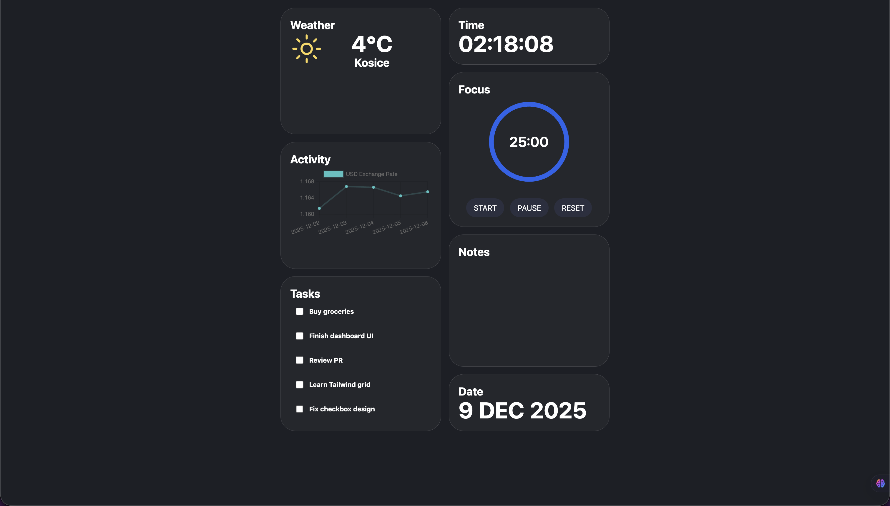

# Motion Dashboard

A minimal productivity dashboard built with **React + Vite**, featuring weather, time, focus timer, activity chart, tasks, and notes.

## Live Demo
[Dashboard](https://dashboard-teal-delta-49.vercel.app/)
## Screenshot


## Features
- Real-time **Weather** (OpenWeather API)
- Live **Clock**
- **Pomodoro Timer** (start / pause / reset)
- **Currency Activity Chart** (Frankfurter API)
- **Tasks** with custom checkboxes
- **Notes** panel
- Current **Date** card

## Tech
- React + Vite
- TailwindCSS
- Framer Motion
- Recharts
- OpenWeather API
- Frankfurter API

##  Setup

```bash
npm install
npm run dev
```

Create `.env` file:
VITE_OPENWEATHER_API_KEY=your_openweather_api_key

